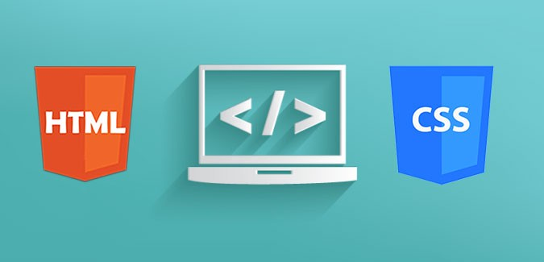

<h1 align = "center">0x09. Implement a design from scratch</h1> 

    

------------

## Description

This is a visual page supposed to achieve the **0x09. Implement a design from scratch** project at [Holberton School.](https://www.    holbertonschool.com "Holberton School."). 
In this project, you will implement from scratch, without any library, a web page. You will use all HTML/CSS/Accessibility/Responsive design knowledges that you learned previously.
You won’t have a lot of instruction, you are free to implement it the way that you want - the objective is simple: Have a fully functional web page that looks the same as the designer file.

------------

## Requirements

- you are not allowed to import external CSS framework (like Bootstrap)
- you are not to use Javascript

------------

## Usage:

As it is just a page with static content, you may download this repository and open the `4-index.html` file with your favorite browser in order to get the final version of the static webpage

------------

## Views:

### Desktop view:

    

### Tablet view:

    

### Mobile view:

    

------------

## Author:

- *Nicolás Zárate*  - [@Nicolanz](https://github.com/Nicolanz)